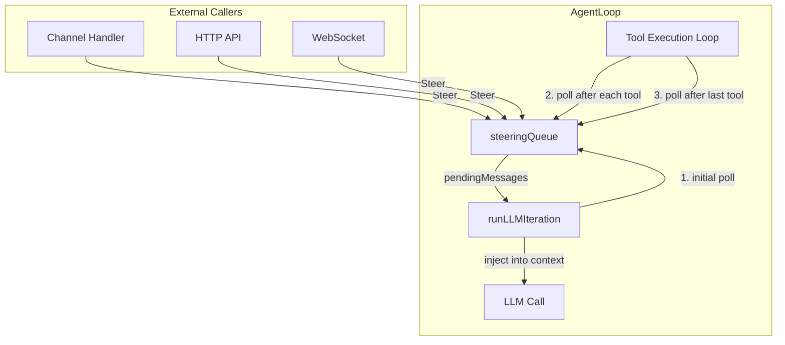
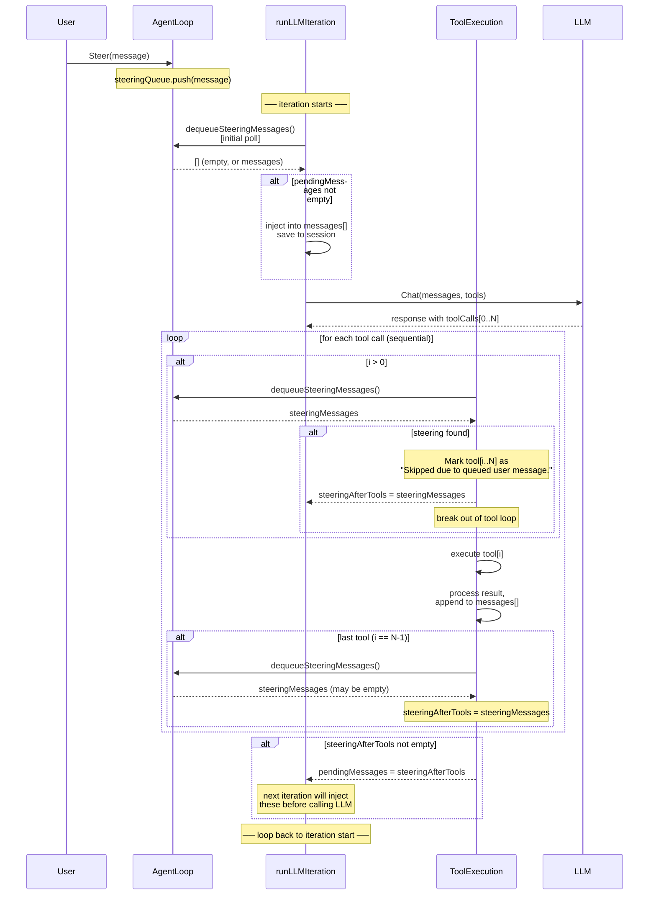
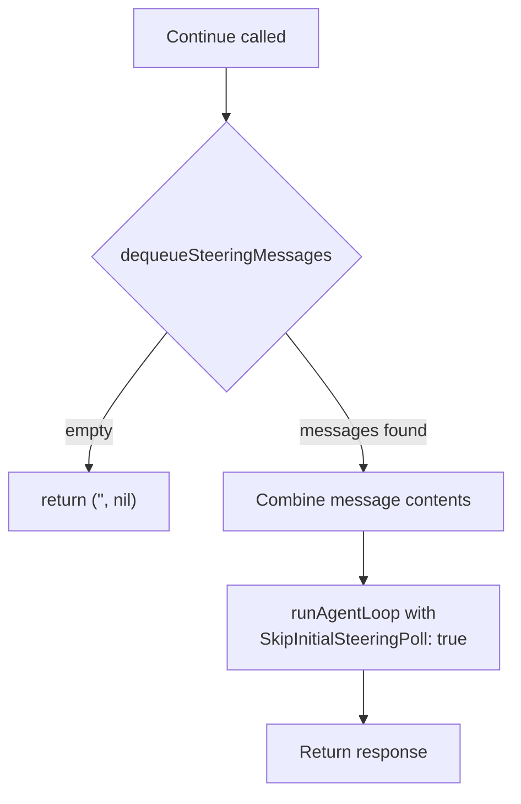

# Steering — Implementation Specification

## Problem

When the agent is running (executing a chain of tool calls), the user has no way to redirect it. They must wait for the full cycle to complete before sending a new message. This creates a poor experience when the agent takes a wrong direction — the user watches it waste time on tools that are no longer relevant.

## Solution

Steering introduces a **message queue** that external callers can push into at any time. The agent loop polls this queue at well-defined checkpoints. When a steering message is found, the agent:

1. Stops executing further tools in the current batch
2. Injects the user's message into the conversation context
3. Calls the LLM again with the updated context

The user's intent reaches the model **as soon as the current tool finishes**, not after the entire turn completes.

## Architecture Overview



## Data Structures

### steeringQueue

A thread-safe FIFO queue, private to the `agent` package.

| Field | Type | Description |
|-------|------|-------------|
| `mu` | `sync.Mutex` | Protects all access to `queue` and `mode` |
| `queue` | `[]providers.Message` | Pending steering messages |
| `mode` | `SteeringMode` | Dequeue strategy |

**Methods:**

| Method | Description |
|--------|-------------|
| `push(msg)` | Appends a message to the queue |
| `dequeue() []Message` | Removes and returns messages according to `mode`. Returns `nil` if empty |
| `len() int` | Returns the current queue length |
| `setMode(mode)` | Updates the dequeue strategy |
| `getMode() SteeringMode` | Returns the current mode |

### SteeringMode

| Value | Constant | Behavior |
|-------|----------|----------|
| `"one-at-a-time"` | `SteeringOneAtATime` | `dequeue()` returns only the **first** message. Remaining messages stay in the queue for subsequent polls. |
| `"all"` | `SteeringAll` | `dequeue()` drains the **entire** queue and returns all messages at once. |

Default: `"one-at-a-time"`.

### processOptions extension

A new field was added to `processOptions`:

| Field | Type | Description |
|-------|------|-------------|
| `SkipInitialSteeringPoll` | `bool` | When `true`, the initial steering poll at loop start is skipped. Used by `Continue()` to avoid double-dequeuing. |

## Public API on AgentLoop

| Method | Signature | Description |
|--------|-----------|-------------|
| `Steer` | `Steer(msg providers.Message)` | Enqueues a steering message. Thread-safe, can be called from any goroutine. |
| `SteeringMode` | `SteeringMode() SteeringMode` | Returns the current dequeue mode. |
| `SetSteeringMode` | `SetSteeringMode(mode SteeringMode)` | Changes the dequeue mode at runtime. |
| `Continue` | `Continue(ctx, sessionKey, channel, chatID) (string, error)` | Resumes an idle agent using pending steering messages. Returns `""` if queue is empty. |

## Integration into the Agent Loop

### Where steering is wired

The steering queue lives as a field on `AgentLoop`:

```
AgentLoop
  ├── bus
  ├── cfg
  ├── registry
  ├── steering  *steeringQueue   ← new
  ├── ...
```

It is initialized in `NewAgentLoop` from `cfg.Agents.Defaults.SteeringMode`.

### Detailed flow through runLLMIteration



### Polling checkpoints

| # | Location | When | Purpose |
|---|----------|------|---------|
| 1 | Top of `runLLMIteration`, before first LLM call | Once, at loop entry | Catch messages enqueued while the agent was still setting up context |
| 2 | Between tool calls, before tool `[i]` where `i > 0` | After each tool finishes | Interrupt mid-batch if the user sent a steering message |
| 3 | After the last tool in the batch | After tool `[N-1]` finishes | Catch messages that arrived during the last tool's execution |

### What happens to skipped tools

When steering interrupts a tool batch at index `i`, all tools from `i` to `N-1` are **not executed**. Instead, a tool result message is generated for each:

```json
{
  "role": "tool",
  "content": "Skipped due to queued user message.",
  "tool_call_id": "<original_call_id>"
}
```

These results are:
- Appended to the conversation `messages[]`
- Saved to the session via `AddFullMessage`

This ensures the LLM knows which of its requested actions were not performed.

### Loop condition change

The iteration loop condition was changed from:

```go
for iteration < agent.MaxIterations
```

to:

```go
for iteration < agent.MaxIterations || len(pendingMessages) > 0
```

This allows **one extra iteration** when steering arrives right at the max iteration boundary, ensuring the steering message is always processed.

### Tool execution: parallel → sequential

**Before steering:** all tool calls in a batch were executed in parallel using `sync.WaitGroup`.

**After steering:** tool calls execute **sequentially**. This is required because steering must be polled between individual tool completions. A parallel execution model would not allow interrupting mid-batch.

> **Trade-off:** This introduces latency when the LLM requests multiple independent tools in a single turn. In practice, most batches contain 1-2 tools, so the impact is minimal. The benefit of being able to interrupt outweighs the cost.

## The Continue() method

`Continue` handles the case where the agent is **idle** (its last message was from the assistant) and the user has enqueued steering messages in the meantime.



**Why `SkipInitialSteeringPoll: true`?** Because `Continue` already dequeued the messages itself. Without this flag, `runLLMIteration` would poll again at the start and find nothing (the queue is already empty), or worse, double-process if new messages arrived in the meantime.

## Configuration

```json
{
  "agents": {
    "defaults": {
      "steering_mode": "one-at-a-time"
    }
  }
}
```

| Field | Type | Default | Env var |
|-------|------|---------|---------|
| `steering_mode` | `string` | `"one-at-a-time"` | `PICOCLAW_AGENTS_DEFAULTS_STEERING_MODE` |


## Design decisions and trade-offs

| Decision | Rationale |
|----------|-----------|
| Sequential tool execution | Required for per-tool steering polls. Parallel execution cannot be interrupted mid-batch. |
| Polling-based (not channel/signal) | Keeps the implementation simple. No need for `select` or signal channels. The polling cost is negligible (mutex lock + slice length check). |
| `one-at-a-time` as default | Gives the model a chance to react to each steering message individually. More predictable behavior than dumping all messages at once. |
| Skipped tools get explicit error results | The LLM protocol requires a tool result for every tool call in the assistant message. Omitting them would cause API errors. The skip message also informs the model about what was not done. |
| `Continue()` uses `SkipInitialSteeringPoll` | Prevents race conditions and double-dequeuing when resuming an idle agent. |
| Queue stored on `AgentLoop`, not `AgentInstance` | Steering is a loop-level concern (it affects the iteration flow), not a per-agent concern. All agents share the same steering queue since `processMessage` is sequential. |
